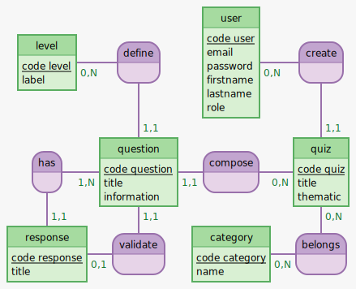

# Conception de Base de Données

---

## MCD (Modèle Conceptuel de Données)

### Vocabulaire

- Entité : C'est l'équivalent d'une table en base de données
- Attribut : C'est l'équivalent d'une colonne en base de données
- Cardinalité : C'est le nombre d'occurrences d'une entité qui peuvent être associées à une occurrence d'une autre entité

### Schéma

```
level: code_level, label
define, 11 question, 0N level
user: code user, email, password, firstname, lastname, role
create, 0N user, 11 quiz

has, 1N question, 11 response
question: code_question, title, information
compose, 0N quiz, 11 question
quiz: code quiz, title, thematic

response: code_response, title
validate, 11 question, 01 response
category: code_category, name
belongs, 0N quiz, 0N category
```




### Astuce sur les relations

3 types de relations :
- ManyToOne (ou OneToMany si on lit dans l'autre sens) : sera représenté en BDD par une clé étrangère du côté One.
- ManyToMany : sera représenté en BDD par une table de liaison (table intermédiaire) avec 2 clés étrangères.
- OneToOne : très rare, mais sera représenté dans la BDD, soit par une fusion des 2 tables, soit par une clé étrangère du côté de notre choix.

## MLD (Modèle Logique de Données)


quiz_category ( <u>#quiz_id</u>, <u>#category_id</u> )

category ( <u>id</u>, name )

level ( <u>id</u>, label )

question ( <u>id</u>, title, information, #level_id, #quiz_id, #response_id )

quiz ( <u>id</u>, title, thematic, #user_id )

response ( <u>id</u>, title, #question_id )

user ( <u>id</u>, email, password, firstname, lastname, role )